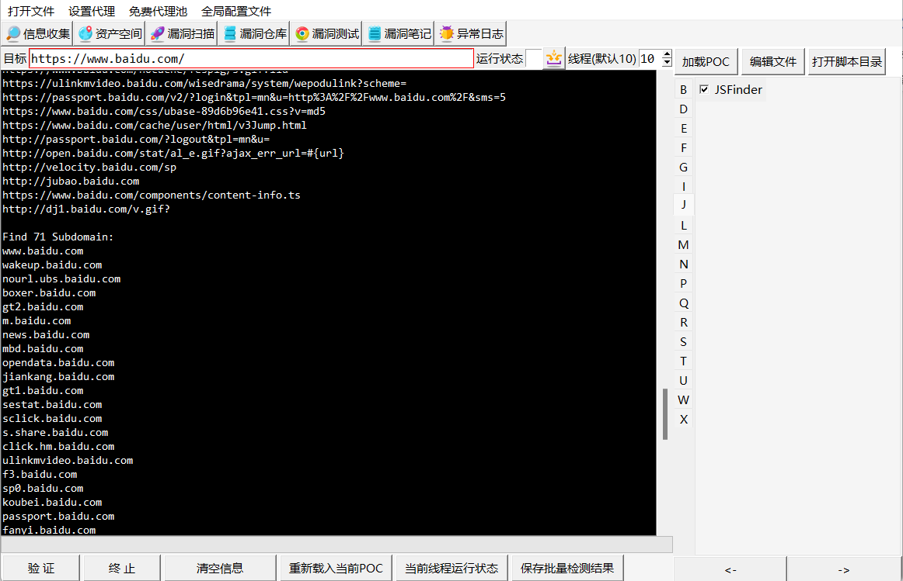
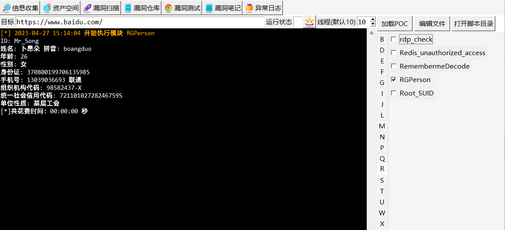
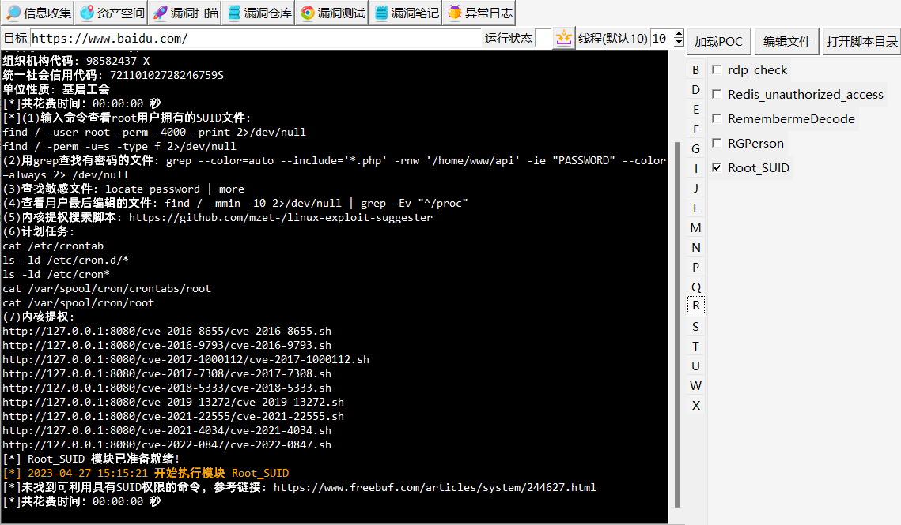
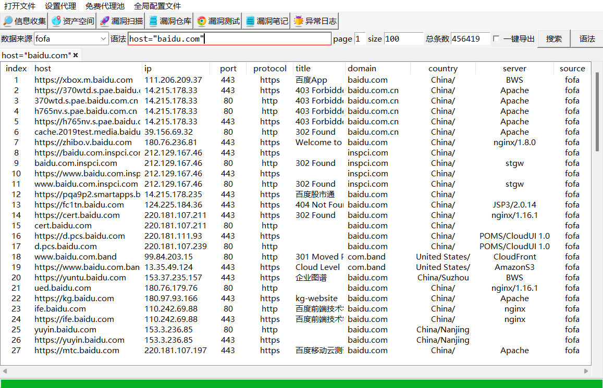
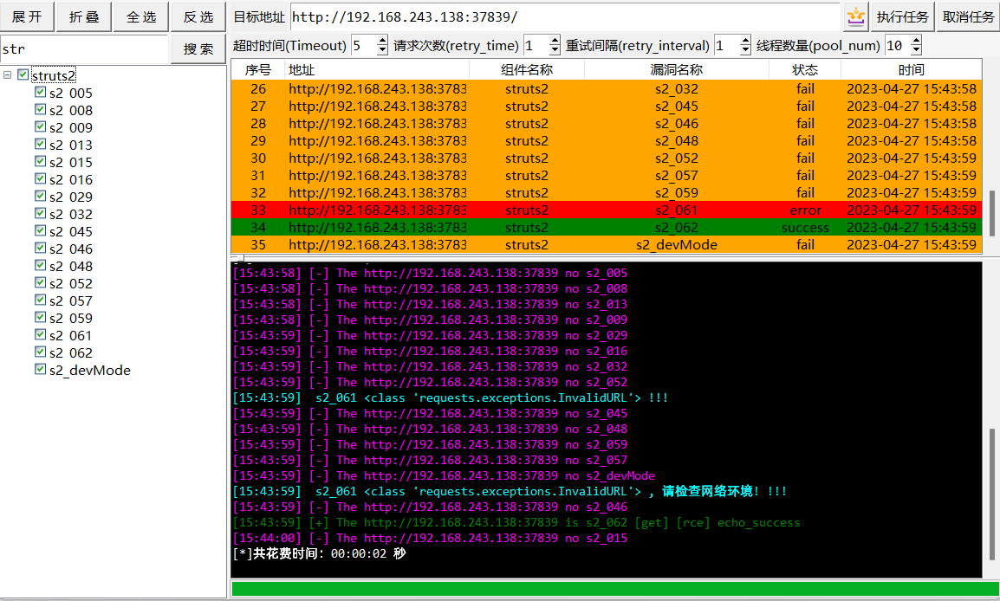
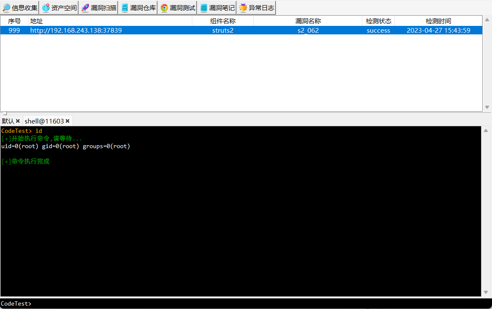
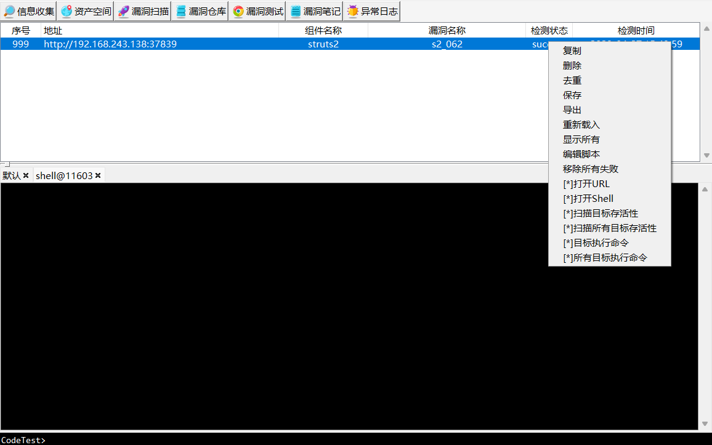

# CodeTest

# 简介
一款常用测试脚本和漏洞扫描脚本的管理工具，方便运行。

集成jsfind、linkfinder、ds_store、idea_exp、bypass403、rgperson、springbootvul等开源脚本。

支持oa、weblogic、struts2、minio、thinkphp等常见框架或cms的漏洞扫描。

## 主要功能
1.信息搜集:
* 网站js敏感文件扫描
* 注册身份信息生成
* 403绕过
* DS_Store、idea文件利用

2.资产空间:
* 空间搜索引擎(fofa、shodan、hunter等)
* 端口扫描+服务识别

3.漏洞扫描:  
* thinkphp、phpcms等开源cms框架
* weblogic、struts2组件
* 常见oa  

4.漏洞仓库
* 批量检测存活
* 批量利用

5.漏洞测试:
* 发包测试
* 根据模板生成exp脚本

6.漏洞笔记:
* 保存笔记

7.异常日志:
* debug日志

## usege
安装运行
``` 
支持Windows系列，mac没做过适配
pip3 config set global.index-url https://mirrors.aliyun.com/pypi/simple/（设置默认源）
pip3 install -r requirements.txt
python3 CodeTest.py
```

## 界面问题
`如果界面组件有问题，修改以下代码`
`self.root.tk.call('tk', 'scaling', scaleFactor / 75)`

## 运行截图

`jsfind`


`rgperson`


`root_suid`


`fofa`


`struts2`






## 参考链接
https://github.com/zhzyker/vulmap


## Star Chart
[](https://starchart.cc/codeyso/CodeTest)

## 免责声明

在原有协议LICENSE中追加以下免责声明。若与原有协议冲突均以免责声明为准。

本工具禁止进行未授权商业用途，禁止二次开发后进行未授权商业用途。

本工具仅面向合法授权渗透测试或者红队检测，在使用本工具进行检测时，您应确保该行为符合当地的法律法规，并且已经取得了足够的授权。

如您在使用本工具的过程中存在任何非法行为，您需自行承担相应后果，我们将不承担任何法律及连带责任。

在使用本工具前，请您务必审慎阅读、充分理解各条款内容，限制、免责条款或者其他涉及您重大权益的条款可能会以加粗、加下划线等形式提示您重点注意。 除非您已充分阅读、完全理解并接受本协议所有条款，否则，请您不要使用本工具。您的使用行为或者您以其他任何明示或者默示方式表示接受本协议的，即视为您已阅读并同意本协议的约束。

## 最近更新
[+] 2023/4/27 项目初始化